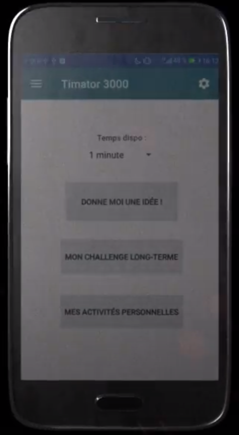

# Timator 3000

 

## Idea
An app that tells you what you can do on your spare time !

## How does it work ?

### Give me an idea
You just have to put how long you have to do nothing, and let yourself be guided by the application.
You can rate the idea so that it comes back more often or less often as you wish.
You can also edit the idea or delete it directly.

### Long term project
This app can also manage your long-term project.
You can split any courses you want by small tasks, and validate each of this tasks like a small activity.
These activities will be proposed in the "Give me an idea" part.

 

### Create your own idea
You can edit the database with your own idea or your own long-term project

Graphic commercial : https://www.youtube.com/watch?v=RjP1fuAeHqo&feature=emb_title&ab_channel=ThibaultChopinet  
Created with Android Studio (JAVA)
